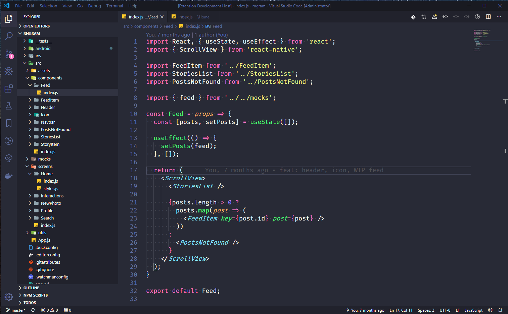

# Dracula Refined for Visual Studio Code

> Yet another [Dracula Theme](https://github.com/dracula/visual-studio-code) fork for [VSCode](http://code.visualstudio.com).

## Install

All instructions can be found at [INSTALL](./INSTALL).

## Contributing

If you'd like to contribute to this theme, please read the [contributing guidelines](./.github/CONTRIBUTING.md).

## License

[MIT License](./LICENSE)
